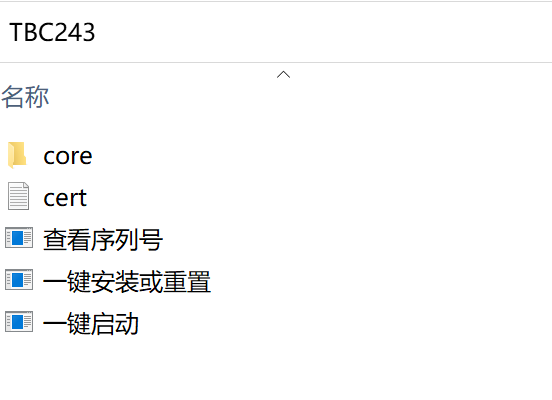
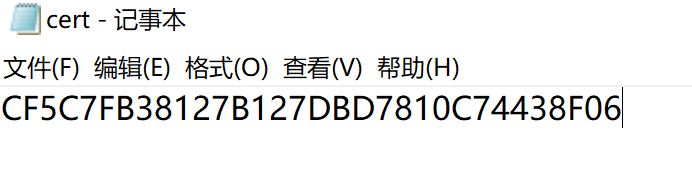
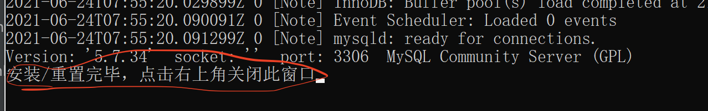

## 安装指引
### 步骤1：解压
将TBC243.7z解压，解压后得到如下图所示的目录：

### 步骤2：安装证书
点击**查看序列号**，得到下面的结果：

* 将序列号**0C8C42A28C1C4200**发给客服(QQ:591218740)，
* 客服会给你一个证书码（比如CF5C7FB38127B127DBD7810C74438F06）
* 将这个证书码放到cert.txt文件中，如下：

* 保存cert.txt

### 步骤3：安装
点击**一键安装或重置**进行安装，大概需要等待半分钟，会出现如下界面提示：

表示安装成功！

### 步骤4：运行魔兽单机
点击**一键启动**，大概需要等待半分钟，启动就会成功！

