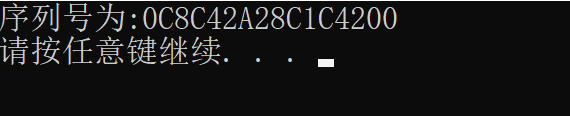

## 安装指引
### 步骤1：解压
将TBC243.7z解压，解压后得到如下图所示的目录：

### 步骤2：安装证书
点击**查看序列号**，得到下面的结果：

* 将序列号**0C8C42A28C1C4200**发给客服(QQ:591218740)，
* 客服会给你一个证书码（比如CF5C7FB38127B127DBD7810C74438F06）
* 将这个证书码放到cert.txt文件中，如下：

* 保存cert.txt

### 步骤3：安装
点击**一键安装或重置**进行安装，大概需要等待半分钟，会出现如下界面提示：

表示安装成功！

### 步骤4：运行魔兽世界单机
点击**一键启动**，大概需要等待半分钟，启动就会成功！

### 步骤4：注册游戏账号
用浏览器打开[http://127.0.0.1:9271/](http://127.0.0.1:9271/)，如下图：

如果想成为GM账号，一定要勾选GM选项！点击注册即可注册成功。

### 步骤5：下载TBC2.4.3客户端，开始游戏
下载地址：

下载完毕后解压。如果您有243的客户端了，就不用下载了，直接用记事本打开realmlist.wtf文件，将文件内容替换为如下图所示：

保存realmlist.wtf文件，点击wow.exe开始游戏！

在单机版中，您可以通过GM指令给自己加金币/等级/技能/装备等，尽情体验游戏的乐趣。还能和好友联机，一起体验游戏。
更多功能等待探索...

